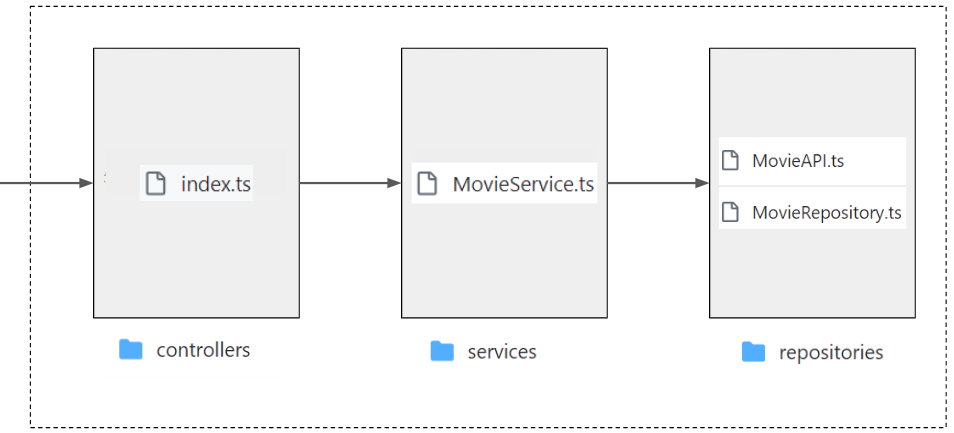
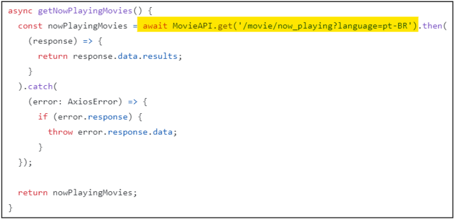
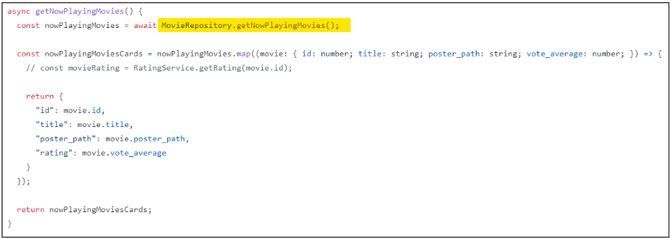
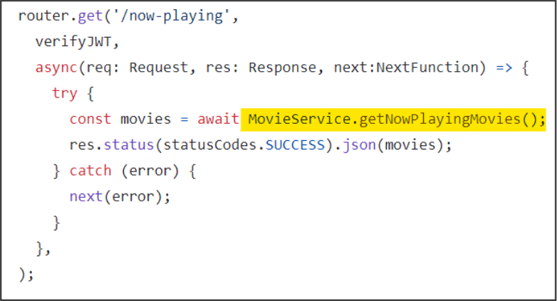

# Escopo do Sistema

## Membros
* Gabriel Lima Barros - Full Stack
* Gabriel Teixeira Carvalho - Full Stack
* Lourenço Montenegro - Full Stack
* Daniel Braga Barbosa - Full Stack

## Objetivo
O objetivo do sistema é criar um ambiente para salvar a avaliar seus filmes favoritos

## Principais Features
* Página de login
* Feed de avaliações de filmes adicionadas por pessoas às quais o usuário se conectou
* Sistema para avaliações de filmes próprias do usuário

## Tecnologias
* JavaScript
* React
* SQLite
* NodeJs

## Link Figma
[Figma Primeira Fila](https://www.figma.com/file/2Hxb0z4MB9lEV2eEqsBTiD/Primeira-Fila?type=design&node-id=0-1&mode=design)

# Backlog do Produto
* Como usuário, gostaria de poder criar uma conta.✅
* Como usuário, gostaria de poder fazer login na minha conta.✅
* Como usuário, gostaria de buscar um filme.✅
* Como usuário, gostaria de avaliar um filme.✅
* Como usuário, gostaria de escrever uma resenha sobre o filme.
* Como usuário, gostaria de ver uma resenha de um usuário sobre um filme.
* Como usuário, gostaria de visualizar informações de um filme selecionado.✅
* Como usuário, gostaria de seguir outro usuário.
* Como usuário, gostaria de curtir resenhas de outros usuários.
* Como usuário, gostaria de ver uma página de perfil com as avaliações de um usuário (incluindo a minha).✅
* Como usuário, gostaria de ver as resenhas de um usuário.
* Como usuário, gostaria de saber quais são os filmes mais bem avaliados. ✅
* Como usuário, gostaria de ver as resenhas mais curtidas.
* Como usuário, gostaria de listar meus filmes favoritos.
* Como usuário, gostaria de visualizar a avaliação média de um filme.✅
* Como usuário, gostaria de marcar um filme como assistido.

# Backlog da Sprint
História #1: Como usuário, gostaria de poder criar uma conta.
- Tarefas e responsáveis:
    - Instalar node.js e Express [Daniel]
    - Configurar banco de dados e criar tabela de usuário [Daniel]
    - Criar e testar uma primeira rota usando o Express [Lourenço]
    - Implementar a lógica de criar usuários no backend [Gabriel Lima]
    - Implementar criptografia de senha [Lourenço]
    - Implementar tela de cadastro [Gabriel Lima]
    - Implementar a lógica de cadastro de usuários com validação da entrada no frontend [Gabriel Teixeira]
    - Conectar tela de cadastro com backend [Gabriel Teixeira]

História #2: Como usuário, gostaria de poder fazer login na minha conta.
- Tarefas e responsáveis:
    - Implementar no backend a lógica de login [Gabriel Lima]
    - Implementar tela de login [Daniel]
    - Implementar a lógica de login com validação da entrada no frontend [Daniel]
    - Conectar tela de login com backend [Lourenço]
    - Implementar tela base para usuários logados [Lourenço]

História #3: Como usuário, gostaria de buscar um filme.
- Tarefas e responsáveis:
    - Implementar visual do componente de busca no frontend [Gabriel Teixeira]
    - Implementar a lógica do componente de busca no frontend [Gabriel Teixeira]
    - Conectar componente de busca com a API de filmes (TMDB) [Gabriel Teixeira]

História #4: Como usuário, gostaria de avaliar um filme.
- Tarefas e responsáveis:
    - Implementar visual do componente de avaliação no frontend [Gabriel Lima]
    - Implementar a lógica do componente de avaliação no frontend [Gabriel Lima]
    - Criar tabela de avaliações dos usuários no banco de dados [Daniel]
    - Implementar rotas no backend para salvar e ler avaliações [Daniel]
    - Implementar rotas no backend para editar e deletar avaliações [Lourenço]
    - Conectar componente de avaliação com o backend [Lourenço]

História #5: Como usuário, gostaria de visualizar informações de um filme selecionado.
- Tarefas e responsáveis:
    - Implementar página de detalhes de filme no frontend [Daniel]
    - Buscar e exibir informações detalhadas de filmes usando a API de filmes no frontend [Daniel]
    - Criar componente para exibir avaliações dos usuários sobre o filme no frontend [Gabriel Lima]
    - Implementar navegação do catálogo de filmes para a página de detalhes no frontend [Lourenço]

História #6:  Como usuário, gostaria de ver uma página de perfil com as avaliações de um usuário (incluindo a minha).
- Tarefas e responsáveis:
    - Criar o design da página de perfil no frontend, exibindo avaliações [Gabriel Lima]
    - Desenvolver endpoints no backend para buscar avaliações de um usuário específico [Gabriel Teixeira]
    - Implementar componentes no frontend para listar as avaliações [Daniel]

História #7: Como usuário, gostaria de marcar um filme como assistido.
- Tarefas e responsáveis:
    - Implementar botão de assistido [Lourenço]
    - Implementar no BD a relação entre usuário e filme [Lourenço]
    - Implementar no backend a lógica de um usuário marcar um filme como assistido [Gabriel Lima]
    - Caso um usuário avalie um filme, ele deve ser marcado como assistido [Gabriel Lima]

História #8: Como usuário, gostaria de saber quais são os filmes mais bem avaliados.
- Tarefas e responsáveis:
    - Implementar sessão de filmes mais bem avaliados na página principal [Gabriel Teixeira]
    - Implementar a lógica para receber os filmes com maior nota média e adicionar à lista da sessão [Daniel]

# Decisões arquitetônicas
A escolha da estrutura arquitetônica é muito importante para o sucesso e a sustentabilidade do projeto. Dessa forma, a Arquitetura Hexagonal foi utilizada nesse projeto, com o objetivo de criar um sistema modular e desacoplado. Esse formato de organização promove uma separação clara entre a lógica de negócio e as interações externas (conexão com API, banco de dados, etc), facilitando a manutenção, a expansão e o teste do sistema.

## Porque o sistema está adotando essa arquitetura?
O sistema está usando essa arquitetura, pois ela traz vantagens relacionadas à sustentabilidade e escalabilidade do código. A proposta da Arquitetura Hexagonal possibilita com que a lógica de negócio seja implementada independentemente das dependências externas, como conexão ao banco de dados. Esse fato, torna a implementação das funcionalidades base da aplicação mais legível e modular,  por meio do baixo acoplamento, permitindo com que a troca de tecnologias externas mais flexível e fácil como, por exemplo, a troca de um banco de dados relacional para um não relacional ou a mudança do ORM (Object-Relational Mapping) utilizado do Prisma para o TypeORM.

Além disso, essa arquitetura favorece a implementação de testes double, no qual irá simular as interfaces externas (adaptadores), sem que seja necessário realizar interações reais para que o sistema seja testado.

## Quais são as portas e adaptadores? Qual o objetivo deles?
As portas são responsáveis por definir os serviços necessários que o núcleo oferece ou requer, agindo como ponto de acesso através dos quais o núcleo da aplicação interage com o ambiente externo.
No sistema Primeira Fila, as portas são representadas pelos arquivos presentes na pasta service de cada entidade no back-end. Por exemplo, em MovieService.ts  a função getNowPlayingMovies possui a porta de entrada para o ambiente externo quando faz a chamada MovieRepository.getNowPlayingMovies, na qual faz a requisição para API que busca pelos filmes em cartaz. Por outro lado, os arquivos nas pastas repositories representam os adaptadores da aplicação, nos quais, efetivamente, implementam as chamadas para uma API externa. Essa estrutura converte os dados retornados da API para o formato que as funções do service podem consumir.

Portanto, podemos definir os adaptadores como responsáveis por pegar as requisições do serviço e transformá-las em chamadas de API externas, além de tratar a resposta para que se encaixe no que o serviço espera. Dessa forma, é possível conectar o núcleo da aplicação com o ambiente externo, adaptando a entrada/saída de dados para um formato em que o domínio pode utilizar. Um exemplo de adaptador no sistema é o arquivo MovieAPI, por meio de chamadas do MovieAPI, os arquivos do service podem obter os dados vindos da API já tratados, com a utilização da biblioteca axios. Dessa maneira, as pastas services se abstém da implementação para se conectar com a API ou banco de dados, tornando o código mais flexível e modular.

## Exemplos
No diagrama a seguir, é possível identificar a organização de arquivos no backend na Arquitetura Hexagonal. O exemplo em questão trata da implementação das operações da entidade Movie e o consumo da API externa e as operações no banco de dados

##Repository
Responsável por interagir com a camada de persistência de dados, como bancos de dados, realizando operações de CRUD.

##Service
Contém a lógica de negócios da aplicação, orquestrando as operações e intermediando entre os repositórios e os controladores.

##Controller 
Lida com a interface de entrada, recebendo e processando as requisições do usuário e direcionando-as para os serviços apropriados.

Segue mais uma representação da arquitetura implementada com o exemplo da entidade Movies.

+-----------------+                             Front-End
|  Controller     |                  +-----------------------------+
|-----------------|  <-------------- |api.get('/movies/top-rated/')|
| -  MovieService |		     +-----------------------------+
+-----------------+
          |
          |
          v
+------------------------------------+
|             MovieService           |
|------------------------------------|
| - getNowPlayingMovies()            |
|------------------------------------|
| - movieAPI: MovieAPI               |
| - movieRepository: MovieRepository |
+------------------------------------+
          |
          |
  +-------+------------------+
  |                          |
  v                          v
+------------------+   +--------------------------+
|    MovieAPI      |   |      MovieRepository     |
|------------------+   |--------------------------|
| - getMovieDetails|   | - save(movie: Movie)     |
+-----------------+    | - find(movieId: string)  |
                       +--------------------------+

# Backlog da Sprint (nova versão)
História #1: Como usuário, gostaria de poder criar uma conta.
- Tarefas e responsáveis:
    - Instalar node.js e Express [Gabriel Teixeira]
    - Configurar banco de dados e criar tabela de usuário [Gabriel Teixeira]
    - Criar e testar uma primeira rota usando o Express [Gabriel Teixeira]
    - Implementar a lógica de criar usuários no backend [Gabriel Teixeira]
    - Implementar tela de cadastro [Gabriel Teixeira]
    - Implementar a lógica de cadastro de usuários com validação da entrada no frontend [Gabriel Teixeira]
    - Conectar tela de cadastro com backend [Gabriel Teixeira]

História #2: Como usuário, gostaria de poder fazer login na minha conta.
- Tarefas e responsáveis:
    - Implementar no backend a lógica de login [Gabriel Teixeira]
    - Implementar tela de login [Gabriel Teixeira]
    - Implementar a lógica de login com validação da entrada no frontend [Gabriel Teixeira]
    - Conectar tela de login com backend [Gabriel Teixeira]
    - Implementar tela base para usuários logados [Gabriel Teixeira e Lourenço]

História #3: Como usuário, gostaria de buscar um filme.
- Tarefas e responsáveis:
    - Implementar visual do componente de busca no frontend [Lourenço]
    - Implementar a lógica do componente de busca no frontend [Lourenço]
    - Conectar componente de busca com a API de filmes (TMDB) [Lourenço e Gabriel Lima]

História #4: Como usuário, gostaria de avaliar um filme.
- Tarefas e responsáveis:
    - Implementar visual do componente de avaliação no frontend [Gabriel Lima e Daniel]
    - Implementar a lógica do componente de avaliação no frontend [Gabriel Lima e Daniel]
    - Criar tabela de avaliações dos usuários no banco de dados [Gabriel Lima]
    - Implementar rotas no backend para salvar e ler avaliações [Gabriel Lima]
    - Implementar rotas no backend para editar e deletar avaliações [Gabriel Lima]
    - Conectar componente de avaliação com o backend [Gabriel Lima]

História #5: Como usuário, gostaria de visualizar informações de um filme selecionado.
- Tarefas e responsáveis:
    - Implementar página de detalhes de filme no frontend [Gabriel Lima]
    - Buscar e exibir informações detalhadas de filmes usando a API de filmes no frontend [Gabriel Lima e Lourenço]
    - Criar componente para exibir avaliações dos usuários sobre o filme no frontend [Gabriel Lima]
    - Implementar navegação do catálogo de filmes para a página de detalhes no frontend [Gabriel Lima]

História #6:  Como usuário, gostaria de ver uma página de perfil com as avaliações de um usuário (incluindo a minha).
- Tarefas e responsáveis:
    - Criar o design da página de perfil no frontend, exibindo avaliações [Lourenço]
    - Desenvolver endpoints no backend para buscar avaliações de um usuário específico [Lourenço]
    - Implementar componentes no frontend para listar as avaliações [Lourenço]

História #7: Como usuário, gostaria de marcar um filme como assistido.
- Tarefas e responsáveis:
    - Implementar botão de assistido [Gabriel Lima]
    - Implementar no BD a relação entre usuário e filme [Gabriel Teixeira]
    - Implementar no backend a lógica de um usuário marcar um filme como assistido [Gabriel Lima]
    - Caso um usuário avalie um filme, ele deve ser marcado como assistido [Gabriel Lima]

História #8: Como usuário, gostaria de saber quais são os filmes mais bem avaliados.
- Tarefas e responsáveis:
    - Implementar sessão de filmes mais bem avaliados na página principal [Gabriel Teixeira]
    - Implementar a lógica para receber os filmes com maior nota média e adicionar à lista da sessão [Gabriel Teixeira]
